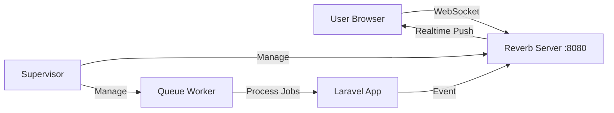

# Setup Laravel Reverb & Supervisor di HestiaCP

## Arsitektur



## 1️⃣ Install Supervisor

SSH ke server dan jalankan:

```bash
sudo apt update
sudo apt install supervisor -y
sudo systemctl enable supervisor
sudo systemctl start supervisor
```

## 2️⃣ Konfigurasi Reverb

### Update `.env` di server production:

```env
# Broadcasting
BROADCAST_CONNECTION=reverb

# Reverb Config (Production)
REVERB_APP_ID=your-app-id
REVERB_APP_KEY=your-app-key
REVERB_APP_SECRET=your-app-secret
REVERB_HOST=0.0.0.0
REVERB_PORT=8080
REVERB_SCHEME=http

# Untuk frontend (domain anda)
VITE_REVERB_APP_KEY="${REVERB_APP_KEY}"
VITE_REVERB_HOST="api.mangoyen.com"
VITE_REVERB_PORT="8080"
VITE_REVERB_SCHEME="http"
```

> 💡 Generate random key/secret dengan: `php artisan reverb:key` atau buat manual string acak.

## 3️⃣ Buat Supervisor Config Files

### Reverb Worker (`/etc/supervisor/conf.d/reverb.conf`)

```bash
sudo nano /etc/supervisor/conf.d/reverb.conf
```

Isi dengan:

```ini
[program:reverb]
process_name=%(program_name)s
command=php /home/admin/web/api.mangoyen.com/public_html/artisan reverb:start
autostart=true
autorestart=true
stopasgroup=true
killasgroup=true
user=admin
numprocs=1
redirect_stderr=true
stdout_logfile=/home/admin/web/api.mangoyen.com/public_html/storage/logs/reverb.log
stopwaitsecs=3600
```

### Queue Worker (`/etc/supervisor/conf.d/laravel-worker.conf`)

```bash
sudo nano /etc/supervisor/conf.d/laravel-worker.conf
```

Isi dengan:

```ini
[program:laravel-worker]
process_name=%(program_name)s_%(process_num)02d
command=php /home/admin/web/api.mangoyen.com/public_html/artisan queue:work --sleep=3 --tries=3 --max-time=3600
autostart=true
autorestart=true
stopasgroup=true
killasgroup=true
user=admin
numprocs=2
redirect_stderr=true
stdout_logfile=/home/admin/web/api.mangoyen.com/public_html/storage/logs/worker.log
stopwaitsecs=3600
```

> ⚠️ Sesuaikan path `/home/admin/web/api.mangoyen.com/public_html/` dengan lokasi Laravel Anda.

## 4️⃣ Aktifkan Supervisor

```bash
# Reload config
sudo supervisorctl reread
sudo supervisorctl update

# Start processes
sudo supervisorctl start reverb:*
sudo supervisorctl start laravel-worker:*

# Cek status
sudo supervisorctl status
```

Output yang diharapkan:
```
laravel-worker:laravel-worker_00   RUNNING   pid 12345, uptime 0:00:10
laravel-worker:laravel-worker_01   RUNNING   pid 12346, uptime 0:00:10
reverb                             RUNNING   pid 12347, uptime 0:00:10
```

## 5️⃣ Buka Port di Firewall

```bash
# Buka port 8080 untuk WebSocket
sudo ufw allow 8080/tcp
```

Atau melalui HestiaCP: **Server > Firewall > Add Rule > Port 8080 TCP**

## 6️⃣ (Optional) Setup Nginx Proxy untuk WebSocket

Jika ingin akses Reverb melalui HTTPS (recommended), tambahkan ke nginx config domain:

```nginx
location /app {
    proxy_pass http://127.0.0.1:8080;
    proxy_http_version 1.1;
    proxy_set_header Upgrade $http_upgrade;
    proxy_set_header Connection "upgrade";
    proxy_set_header Host $host;
    proxy_set_header X-Real-IP $remote_addr;
    proxy_read_timeout 60s;
}
```

## 7️⃣ Test Koneksi

### Test dari server:
```bash
curl http://localhost:8080
```

### Clear cache Laravel:
```bash
cd /path/to/laravel
php artisan config:clear
php artisan cache:clear
```

## 📌 Monitoring Commands

```bash
# Cek status semua proses
sudo supervisorctl status

# Restart Reverb
sudo supervisorctl restart reverb

# Restart Queue Workers
sudo supervisorctl restart laravel-worker:*

# Lihat log realtime
tail -f /path/to/laravel/storage/logs/reverb.log
tail -f /path/to/laravel/storage/logs/worker.log
```

## ⚠️ Troubleshooting

| Error | Solusi |
|-------|--------|
| `Connection refused` | Pastikan Reverb sudah running: `sudo supervisorctl status` |
| `Permission denied` | Cek user di supervisor config harus sama dengan web user |
| `Port already in use` | Kill proses lama: `sudo fuser -k 8080/tcp` |

---

## ✅ Checklist Setup

- [ ] Install Supervisor
- [ ] Update `.env` dengan config Reverb production
- [ ] Buat `/etc/supervisor/conf.d/reverb.conf`
- [ ] Buat `/etc/supervisor/conf.d/laravel-worker.conf`
- [ ] Reload dan start Supervisor
- [ ] Buka port 8080 di firewall
- [ ] Test koneksi
